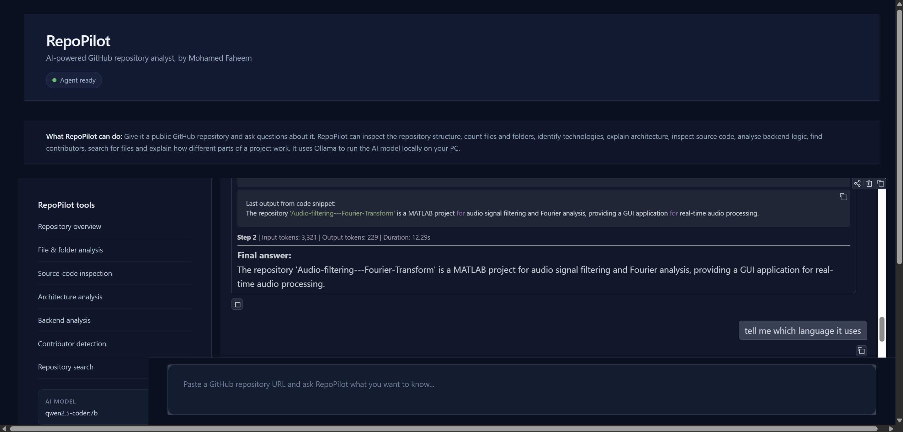
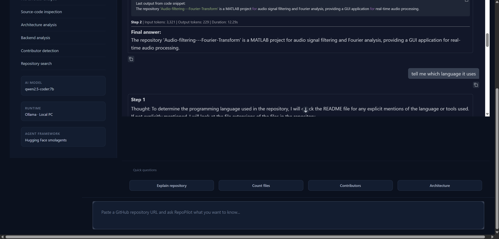
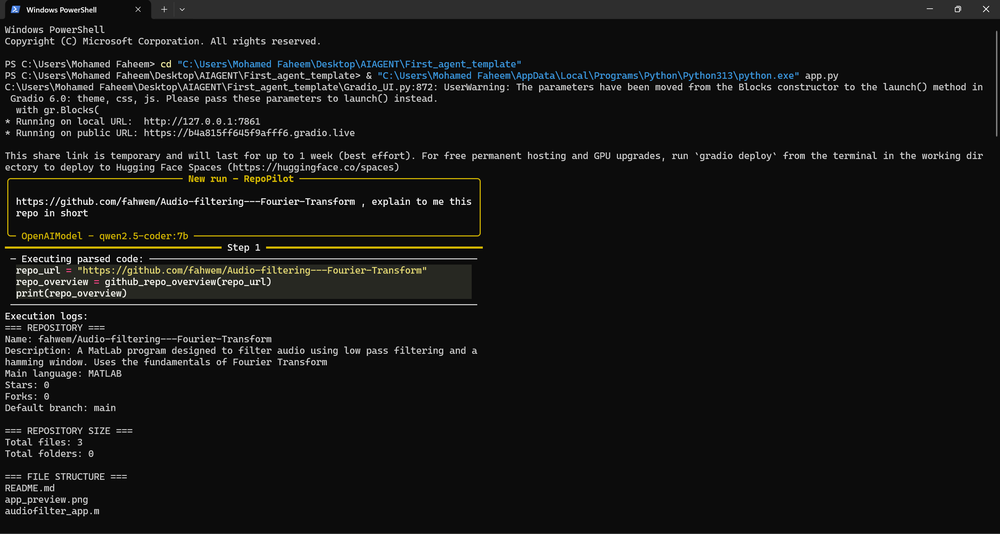
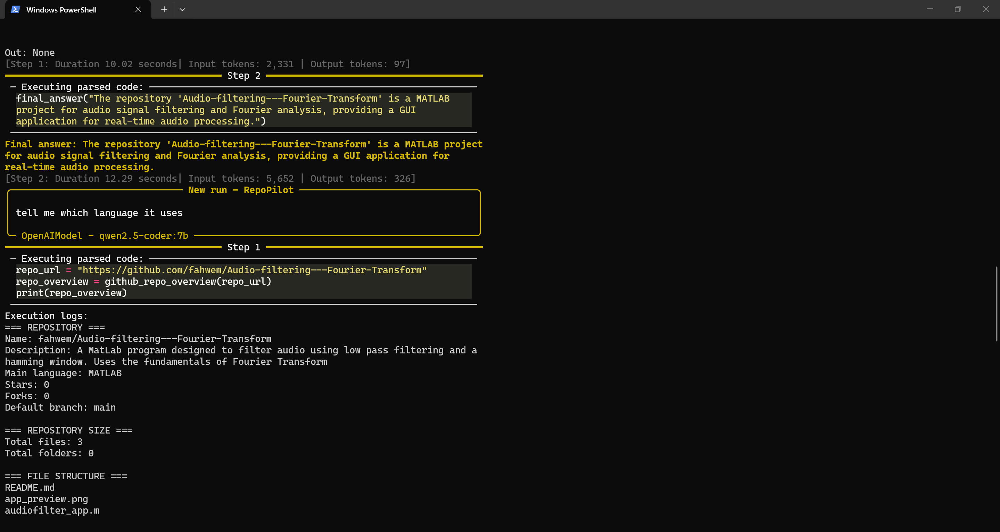

<div align="center">

# RepoPilot

**A local, privacy-first AI agent that reads and explains any GitHub repository — 100% offline.**

[](https://www.python.org/)
[](https://ollama.com/)
[](https://github.com/huggingface/smolagents)
[](https://www.gradio.app/)
[](LICENSE)

[Overview](#overview) • [Features](#features) • [Screenshots](#screenshots) • [Demo Video](#demo-video) • [Getting Started](#getting-started) • [Usage](#usage-example) • [Limitations](#limitations) • [Project Structure](#project-structure) • [Roadmap](#roadmap)

</div>

---

## Overview

**RepoPilot** is an open-source AI agent that analyzes **public** GitHub repositories for you. Give it a repo URL and it will:

- Inspect the top-level file and folder structure
- Read the README and key source files
- Explain what the project does and how it's organized, in plain language
- Identify the main language and technologies used
- Answer follow-up questions, with the current repo kept in conversation context

Everything runs **locally on your machine** — no code, prompts, or execution logs are ever sent to a third-party cloud API.

### Why I Built This

Navigating large, unfamiliar, or poorly documented repositories takes time. RepoPilot was built to quickly read a codebase, summarize what it does, and answer targeted technical questions — without shipping your code or context off your machine.

---

## Features

| Feature | Description |
|---|---|
| **Repo Analysis** | Point it at a public GitHub URL and get a quick structural + functional breakdown |
| **Conversational Follow-ups** | Ask follow-up questions — RepoPilot keeps the context of the current repo |
| **Fully Local** | Powered by [Ollama](https://ollama.com/) running `qwen2.5-coder:7b` — no API keys, no cloud, no cost |
| **Agentic Reasoning** | Built on Hugging Face's [smolagents](https://github.com/huggingface/smolagents) for tool-calling and step-by-step reasoning |
| **Simple Web UI** | Clean [Gradio](https://www.gradio.app/) interface with real-time reasoning logs |
| **Language & Tech Detection** | Identifies the main language and technologies used, based on file extensions, README, and repo metadata |

---

## Screenshots

<table>
  <tr>
    <td width="50%" align="center">
      <br/>
      <sub><b>1. Web dashboard</b> — RepoPilot answering "explain to me this repo in short"</sub>
    </td>
    <td width="50%" align="center">
      <br/>
      <sub><b>2. Quick question dashboard</b> — useful for small quick questions (paste the GitHub repo link in the area assigned)</sub>
    </td>
  </tr>
  <tr>
    <td width="50%" align="center">
      <br/>
      <sub><b>3. Terminal view</b> — RepoPilot inspecting a repo's structure and metadata</sub>
    </td>
    <td width="50%" align="center">
      <br/>
      <sub><b>4. Terminal view</b> — step-by-step agent reasoning and final answer</sub>
    </td>
  </tr>
</table>

---

## How It Works

RepoPilot combines a local LLM with lightweight local tooling:

1. **Framework** — Uses Hugging Face's `smolagents` for tool-calling and agentic reasoning.
2. **Local Model** — Runs `qwen2.5-coder:7b` through Ollama, entirely on your own hardware.
3. **Interface** — A Gradio web UI provides an interactive chat experience with visible reasoning steps.
4. **Analysis Engine** — Custom Python utilities call the public GitHub API to inspect a repo's directory structure, count files/folders, and pull key source files in real time to feed context to the model.

---

## Getting Started

Follow these steps to get RepoPilot running on your own machine.

### Step 1 — Install Prerequisites

1. Make sure **Python 3.10+** is installed:
   ```bash
   python --version
   ```
2. Install **Ollama** from [ollama.com](https://ollama.com/).
3. Pull the model RepoPilot uses:
   ```bash
   ollama pull qwen2.5-coder:7b
   ```

### Step 2 — Clone the Repository

```bash
git clone https://github.com/fahwem/RepoPilot.git
cd RepoPilot
```

### Step 3 — Create a Virtual Environment (recommended)

```bash
python -m venv venv

# Activate it
# Windows:
venv\Scripts\activate
# macOS / Linux:
source venv/bin/activate
```

### Step 4 — Install Dependencies

```bash
pip install -r requirements.txt
```

### Step 5 — Make Sure Ollama Is Running

In a separate terminal, start the Ollama service (if it isn't already running in the background):

```bash
ollama serve
```

### Step 6 — Launch RepoPilot

```bash
python app.py
```

Gradio will print a local URL in your terminal, typically:

```
Running on local URL:  http://127.0.0.1:7860
```

Open that link in your browser to start using RepoPilot.

### Step 7 — Analyze a Repository

1. Paste a **public** GitHub repository URL into the input box.
2. Ask a question, e.g. *"Explain this repo in short"* or *"Which language does it use?"*
3. Read the agent's step-by-step reasoning and final answer.
4. Ask follow-up questions — the conversation context is preserved.

---

## Usage Example

```
Input Repository: https://github.com/fahwem/Audio-filtering---Fourier-Transform
User Query:        "explain to me this repo in short"

Agent Output:
- Detects file structure (README.md, audiofilter_app.m)
- Identifies MATLAB as the main language
- Summarizes the Fourier audio filtering GUI
```

---

## Limitations

RepoPilot is a focused GitHub Q&A agent, not a full software-engineering agent. Current limitations:

- **Public repos only** — uses unauthenticated public GitHub API requests, so it can't access private repositories, and it doesn't handle API rate limits gracefully or use authenticated requests for higher limits.
- **No code-content search** — the search tool matches filenames and paths, not text inside files.
- **Limited scale** — file trees, README text, source files, and contributor lists are capped/truncated, so very large repositories aren't fully analyzed.
- **Read-only, no execution** — it doesn't clone or run a project, install dependencies, execute tests, reproduce bugs, or inspect runtime errors.
- **No code changes** — it can't edit code, create commits, open pull requests, review diffs, or manage GitHub issues.
- **No security tooling** — no security scans, dependency audits, license checks, or secret/vulnerability detection.
- **Bounded reasoning per request** — each run is limited to a few steps and a handful of targeted API calls, so it can't build a deep understanding of an entire repository in one go.
- **No external browsing** — it doesn't look up related docs, package versions, or other context on the web.
- **No strong citations** — answers aren't backed by linked references for every claim.
- **No uploads or accounts** — no file uploads, images, voice, persistent chat history, user accounts, or team collaboration.

---

## Project Structure

```
RepoPilot/
├── tools/            # Custom tools used by the agent (repo inspection, parsing, etc.)
├── docs/
│   ├── screenshots/   # README images
│   └── demo/          # Demo video
├── Gradio_UI.py       # Gradio web interface logic
├── app.py             # Application entry point
├── agent.json         # Agent configuration
├── prompts.yaml       # System / task prompts for the agent
├── requirements.txt   # Python dependencies
└── README.md
```

---

## Tech Stack

- **Language:** Python 3.10+
- **Agent Framework:** [smolagents](https://github.com/huggingface/smolagents)
- **Local LLM Runtime:** [Ollama](https://ollama.com/) (`qwen2.5-coder:7b`)
- **UI:** [Gradio](https://www.gradio.app/)
- **Other Dependencies:** `markdownify`, `requests`, `duckduckgo_search`, `pandas`

---

## Roadmap

- [ ] Support for private repositories (via authenticated requests)
- [ ] Content-level code search (not just filenames/paths)
- [ ] Streaming responses in the UI
- [ ] Support for additional local models
- [ ] Exportable analysis reports (Markdown / PDF)

---

## License

Distributed under the MIT License. See `LICENSE` for more information.

---
